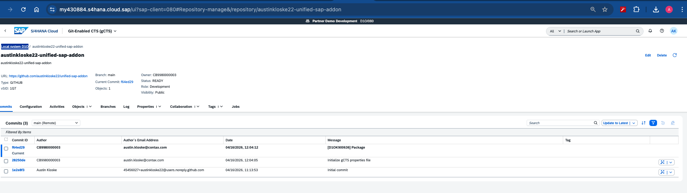
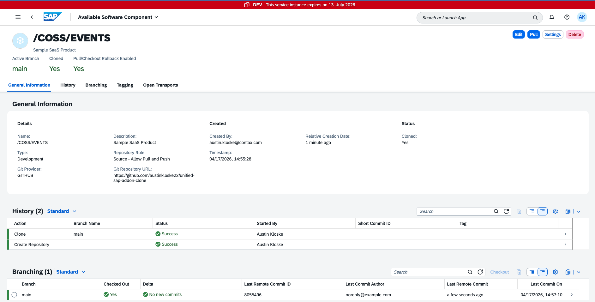

# unified-sap-addon

Unified SAP Add-on for Public Cloud, Steampunk & S/4 HANA

## Overview

This is the **gCTS Enabled Public Cloud Repository** — the central source of truth for the `/COSS/_UNIFIED` software component. It manages the transport delivery of a unified ABAP add-on across three SAP landscapes:

- **SAP Public Cloud** — Origin system (D10) where development occurs
- **BTP ABAP Environment (Steampunk)** — 3-subaccount landscape (DEV → TST → EAT/AMT Provider)
- **S/4 HANA on AWS** — Development (SED) and Test (SET) systems via Add-on Assembly Kit

## Architecture

> View the interactive diagram: [`docs/gcts-transport-diagram.html`](docs/gcts-transport-diagram.html)

```
                        Release Transport
  ┌──────────────┐      Request         ┌─────────────────────┐
  │  SAP Public  │ ───────────────────► │  This Repo          │
  │  Cloud (D10) │                      │  (Source of Truth)   │
  └──────────────┘                      └──────────┬──────────┘
                                           │              │
                                    2-way mirror    Clone/Pull
                                           │              │
                                           ▼              ▼
                                  ┌──────────────┐  ┌───────────┐
                                  │  Clone Repo  │  │  AWS SED  │
                                  │  (BTP ABAP)  │  │  S/4 HANA │
                                  └──────┬───────┘  └─────┬─────┘
                                         │                │
                                   Clone/Pull        Assembly Kit
                                         │                │
                                         ▼                ▼
                                  ┌──────────────┐  ┌───────────┐
                                  │  BTP DEV →   │  │  AWS SET  │
                                  │  TST → EAT   │  │  S/4 HANA │
                                  └──────────────┘  └───────────┘
```

### Transport Flow

1. **D10 → This Repo** — Developers release transport requests in the SAP Public Cloud D10 system. Serialized ABAP objects land in this repository.
2. **This Repo ↔ Clone Repo** — A custom 2-way mirroring solution keeps this source of truth in sync with the [BTP ABAP Environment clone](https://github.com/austinkloske22/unified-sap-addon-clone).
3. **Clone → BTP DEV** — The clone repo feeds the Steampunk DEV system via gCTS Clone/Pull Software Component.
4. **DEV → TST → EAT** — Internal BTP transport chain moves the component through the Steampunk landscape. A Multitenant Application connects at the EAT/Provider layer.
5. **This Repo → SED** — The source of truth also feeds the S/4 HANA Development system on AWS.
6. **SED → SET** — Add-on Assembly Kit propagates from Development to Test within the AWS landscape.

## ABAP System Connections

### D10 — SAP Public Cloud (gCTS)

This repo is linked to the D10 system via Git-Enabled CTS (gCTS).



| Property | Value |
|----------|-------|
| **System** | Partner Demo Development D10/080 |
| **Repository** | `austinkloske22-unified-sap-addon` |
| **Role** | Development |
| **Status** | READY |
| **Branch** | `main` |

### BTP DEV — ABAP Environment (Software Component)

The [clone repo](https://github.com/austinkloske22/unified-sap-addon-clone) is linked to the BTP DEV system as software component `/COSS/EVENTS`.



| Property | Value |
|----------|-------|
| **System** | BTP ABAP Environment (DEV) |
| **Software Component** | `/COSS/EVENTS` |
| **Repository Role** | Source — Allow Pull and Push |
| **Status** | Cloned, `main` checked out |

The **"Allow Pull and Push"** role means the BTP system can both consume and publish changes to the clone repo — this is what enables the bidirectional sync needed for 2-way mirroring.

## Bidirectional Sync

The two repos have independent git histories and independent gCTS identity configs, so standard git merge/cherry-pick won't work. Instead, we use `rsync`-based file mirroring that syncs only the ABAP content (`objects/`, `.gctsmetadata/`) while preserving each repo's identity (`.gcts.properties.json`, `README.md`, etc.).

### What Syncs vs What's Protected

| Synced (ABAP content) | Protected (repo identity) |
|------------------------|---------------------------|
| `objects/**` (mirrored) | `.gcts.properties.json` |
| `.gctsmetadata/nametabs/**` (additive) | `.gitignore` |
| `.gctsmetadata/objecttypes/**` (additive) | `README.md`, `CLAUDE.md`, `docs/` |

- **Mirrored** = exact copy, files deleted in source are deleted in target
- **Additive** = new files copied over, target-specific files preserved

### GitHub Actions (Active)

Automated sync via GitHub Actions. Triggers on every push to `main` that modifies `objects/` or `.gctsmetadata/`.

**Forward sync** (source → clone): [`.github/workflows/sync-to-clone.yml`](.github/workflows/sync-to-clone.yml)
- Triggers when D10 pushes a transport to this repo
- Syncs ABAP objects and metadata to [unified-sap-addon-clone](https://github.com/austinkloske22/unified-sap-addon-clone)
- Commits with `[SYNC] <original-transport-message>` prefix

**Reverse sync** (clone → source): Lives in the [clone repo's workflow](https://github.com/austinkloske22/unified-sap-addon-clone/blob/main/.github/workflows/sync-to-source.yml)
- Triggers when BTP pushes changes to the clone repo
- Syncs ABAP objects and metadata back to this repo

**Loop prevention:** Sync commits are made by `github-actions[bot]`. Both workflows skip when `github.actor == 'github-actions[bot]'`, breaking the cycle.

#### Setup

1. Create a GitHub Personal Access Token (PAT) with `repo` scope at [github.com/settings/tokens](https://github.com/settings/tokens)
2. Add the PAT as a repository secret named `SYNC_PAT` in **both** repos:
   - [unified-sap-addon secrets](https://github.com/austinkloske22/unified-sap-addon/settings/secrets/actions)
   - [unified-sap-addon-clone secrets](https://github.com/austinkloske22/unified-sap-addon-clone/settings/secrets/actions)

### Bitbucket Pipelines (Future)

> This section is a placeholder. The production deployment will use Bitbucket private repos with Bitbucket Pipelines for the same sync logic.

The GitHub Actions workflows will be ported to `bitbucket-pipelines.yml` equivalents using Bitbucket's pipe-based architecture. Key differences:
- Trigger via `push` to `main` with path filters in `bitbucket-pipelines.yml`
- Cross-repo push uses Bitbucket App Passwords instead of GitHub PATs
- Pipeline variables replace GitHub Actions secrets

### Local Script (Manual Fallback)

For initial population, debugging, or manual overrides:

```bash
# Preview what would change (dry run)
./scripts/gcts-sync.sh status

# Sync source → clone
./scripts/gcts-sync.sh forward

# Sync clone → source
./scripts/gcts-sync.sh reverse
```

## Repository Structure

```
unified-sap-addon/
├── objects/                      # Serialized ABAP objects (gCTS JSON format)
├── .gctsmetadata/                # gCTS metadata table definitions
├── .gcts.properties.json         # gCTS repository configuration
├── .github/workflows/
│   └── sync-to-clone.yml        # GitHub Actions: forward sync to clone repo
├── scripts/
│   └── gcts-sync.sh             # Local sync script (forward/reverse/status)
├── docs/
│   ├── gcts-transport-diagram.html           # Interactive architecture diagram
│   ├── Public-Cloud-gCTS-repo.png            # D10 gCTS system screenshot
│   └── BTP-ABAP-Software-component-repo.png  # BTP DEV system screenshot
└── CLAUDE.md                     # Development context
```

## Key Details

| Property | Value |
|----------|-------|
| **Namespace** | `/COSS/` |
| **Package** | `/COSS/_UNIFIED` |
| **Delivery Unit** | `ZPARTNER` |
| **gCTS Format** | JSON v6, table content enabled |
| **Role** | Source of truth (Public Cloud) |

## Related Repositories

- [unified-sap-addon-clone](https://github.com/austinkloske22/unified-sap-addon-clone) — gCTS Enabled BTP ABAP Environment Repo (synced via GitHub Actions)
